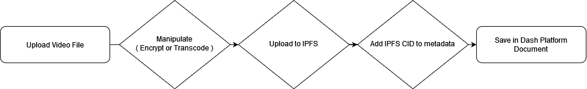

# Dash DApp Video Uploader

## Usage
The current repo includes all functionality required to submit an video file using `dist/index.html`. On submission the file will be manipulated according to the selected options ( encrypted, transcoded, etc. ) before being uploaded to IPFS, once upload is complete all metadata + IPFS file pins will be saved in a Dash Platform document.

If you wish to add this functionality to your own DApp the important files are `src/init.js`, `src/upload/video,js`, and `src/uploader.js`

### `src/init.js`
Includes the basic initialization steps to establish a Dash Platform connection and ensure tDash is present in the users wallet.

### `src/upload/video.js`
Includes abstracted contract and document CRUD operations ( create, update, delete ). During testnet development Platform is often reset during major upgrades. Once Platform hits mainnet the `contract` variable should be hard coded. A Dash Platform Data Contract defines the data structure for a given Document and serves as a lookup key. There's no reason to generate a new contract for every user.

### `src/uploader.js`
Includes the logic that reads files from HTML input fields, manipulates, calls the IPFS upload method, and Platform CRUD operations provided by `src/upload/video.js`.

Each `directive.on` method located at the bottom of the file maps to dom events triggered by the JS framework in use for this demo. You can replace with your own DOM event handlers or vanilla JS `addEventListener`.
